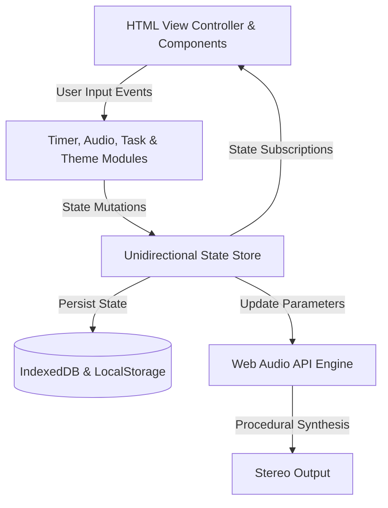

# ⏳ Deep Focus

> An elegant, client-side, offline-first productivity workspace designed to cultivate deep cognitive flow.

---

## 🚀 Overview

Deep Focus is an offline-first productivity workspace built to help users maintain deep cognitive flow without relying on cloud services or distracting interfaces.

Unlike traditional Pomodoro applications, Deep Focus combines real-time procedural sound synthesis, a 5-band acoustic equalizer, distraction tracking, local-first analytics, and an interactive workspace guide into a single browser-based experience.

The application runs entirely on the client side with **zero backend dependencies**, ensuring complete privacy while remaining fast, responsive, and installable as a Progressive Web App (PWA).

---

## 🧭 Why Deep Focus?

Traditional productivity tools often depend on repetitive audio loops, cloud synchronization, or analytics services that interrupt focus and collect unnecessary user data.

Deep Focus takes a different approach.

### 🎵 Procedural Audio

Instead of looping MP3 files, Deep Focus synthesizes sound in real time using the browser's Web Audio API.

Dynamic sound generation produces continuously evolving ambient soundscapes that reduce repetition and help minimize auditory fatigue.

---

### 🧠 Cognitive Behavioral Grounding

Whenever attention drifts, users can log distractions directly within the application.

Rather than treating distractions as failures, the system encourages awareness and reflection before gently returning attention to the active task.

---

### 🔒 Local-First Privacy

No accounts.

No cloud synchronization.

No analytics SDKs.

Tasks, journals, themes, and productivity statistics remain stored locally using IndexedDB and LocalStorage.

---

## 💎 Core Capabilities

### 🎧 Auditory Studio & Equalizer

- 8-channel procedural audio mixer
- Ambient synthesizers including:
  - Zen Rain
  - Forest Wind
  - Coffee Shop Murmur
  - Ocean Tide
  - Static Veil (White Noise)
  - Mechanical Click
  - Paper Rustle
  - Crackling Fire

- 5-band graphic equalizer
- Audio presets including:
  - Deep Focus
  - Tinnitus Relief

- Procedural ending chimes with smooth 5-second fade-out

---

### ⏳ Focus Engine

- One-click 60-minute focus session
- Automatic Pomodoro cycle
- Long break after four completed focus sessions
- Zen Mode fullscreen workspace
- Animated breathing ring

---

### 📊 Cognitive Logging & Analytics

- Distraction Logger
- Reflection Journal
- Daily focus tracking
- Weekly productivity visualization
- Dynamic SVG charts

---

### 💡 Smart Recommendations

Rotating productivity recommendations provide evidence-based focus suggestions related to:

- Focus blocks
- Wave entrainment
- Acoustic masking
- Workspace habits

---

### 🤖 Zenith AI _(Coming Soon)_

A preview of the planned local AI assistant for private focus coaching and sound optimization.

---

## 🛠️ Technology Stack & Browser APIs

Deep Focus is built entirely using modern browser technologies.

### Audio Engine

Built using the **Web Audio API**, including:

- OscillatorNodes
- Binaural Beat generation
- BiquadFilterNodes
- StereoPannerNodes
- DynamicsCompressorNode

---

### Local-First Architecture

- IndexedDB
- LocalStorage
- Custom asynchronous transaction layer

---

### Offline Support

- Progressive Web App (PWA)
- Service Worker
- Cache-first strategy
- Offline startup support

---

### State Management

A lightweight unidirectional state store using a subscribe/publish architecture keeps the interface synchronized with application state while remaining fully decoupled.

---

## 📐 System Architecture



---

## 🧠 How It Works

1. User interacts with the interface.
2. Application modules process user actions.
3. The central state store updates application state.
4. State changes automatically synchronize:
   - UI components
   - Local storage
   - Audio engine

5. Procedural audio is generated in real time while all user data remains stored locally.

---

## 📂 Project Structure

```filepath
DeepFocus/
├── css/
├── js/
├── sw.js
├── manifest.json
├── vercel.json
└── index.html
```

---

## 🔧 Core Components Explained

### CSS

- **main.css** — Layout, typography, variables, and global styling
- **themes.css** — Theme definitions
- **components.css** — UI components, animations, cards, Zen Mode

### Audio

- **studio.js** — AudioContext management
- **synth.js** — Procedural sound synthesis
- **eq.js** — Five-band equalizer implementation

### State

- **store.js** — Central reactive state management
- **db.js** — IndexedDB abstraction layer

### Timer

- **timer.js** — Focus sessions and Pomodoro scheduling

### Intelligence

- **recommender.js** — Productivity recommendation engine

### UI

- **view.js** — Main application controller
- **components/** — Journal, Studio, Todo, and Zen Mode controllers

### Root Files

- **sw.js** — Service Worker
- **manifest.json** — Progressive Web App configuration
- **vercel.json** — Deployment configuration
- **index.html** — Main application entry point

---

## 🚀 Getting Started

### Prerequisites

- Modern web browser

No installation, package manager, or backend setup is required.

---

### Run Locally

#### Option 1

Open `index.html` directly in your browser.

#### Option 2 (Recommended)

Serve the project locally to enable full PWA functionality.

```bash
# Node.js
npx serve .

# Python
python -m http.server 8000
```

Then open:

- http://localhost:3000
- http://localhost:8000

---

## ⚡ Deployment

Deep Focus is preconfigured for deployment on **Vercel**.

The included `vercel.json` configures cache headers so that the Service Worker is never stale after deployment updates.

Deploy with:

```bash
vercel --prod
```

---

## 🗺️ Roadmap

- [ ] Zenith AI with local WebGPU inference
- [ ] Local-network synchronization using WebRTC
- [ ] Automatic acoustic room calibration

---

## 👨‍💻 Author

**Sumanth Mamidi**

Engineering • Design • Sound Synthesis

Portfolio:
https://github.com/mamidi-sumanth

---

## 📄 License

Licensed under the MIT License.

See the **LICENSE** file for details.
