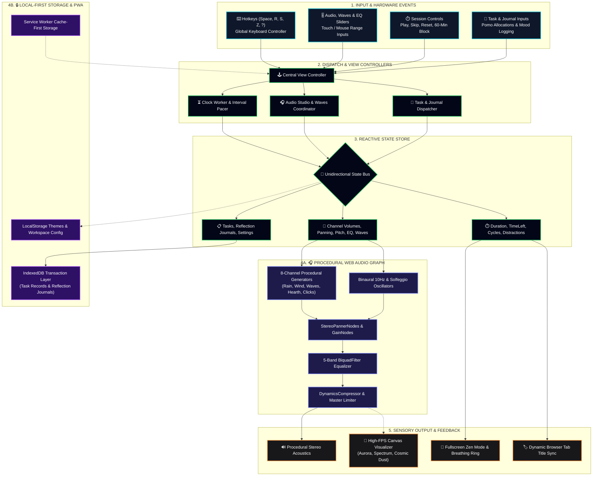

<div align="center">

# ✦ DeepFocus Studio
### *Adaptive Ambient Workspace & Real-Time Cognitive Flow Studio*

**Mix organic ambient soundscapes, lock into deep focus sessions, and silence distractions directly in your browser.**

[](https://developer.mozilla.org/en-US/docs/Web/API/Web_Audio_API)
[](https://developer.mozilla.org/en-US/docs/Web/JavaScript)
[](https://developer.mozilla.org/en-US/docs/Web/API/IndexedDB_API)
[](https://developer.mozilla.org/en-US/docs/Web/Progressive_web_apps)
[](./LICENSE)

[](https://deep-focus-three.vercel.app/)

[Key Highlights](#highlights) • [The Four Workspaces](#workspaces) • [Controls Matrix](#controls) • [Architecture](#architecture) • [Quickstart](#quickstart) • [Technology Stack](#tech-stack)

</div>

---

<a id="highlights"></a>
## 🌟 Key Highlights

> **⚡ Zero-Sample Procedural Synthesis**  
> Synthesizes 8 organic acoustic channels dynamically in real-time via the Web Audio API. Eliminates repetitive MP3 loops to prevent auditory fatigue and generate seamless sonic isolation.
>
> **🧠 Cognitive Distraction Grounding**  
> Operationalizes cognitive reframing through a dedicated, one-tap distraction tracker. Acknowledging interruptions resets working memory and smoothly redirects focus back to the active task.
>
> **🔒 Zero-Telemetry Local-First Engine**  
> All sessions, reflections, custom mixes, and analytics persist entirely inside browser IndexedDB. No tracking pixels, no analytics SDKs, and zero cloud exposure.
>
> **⏱️ Dual Flow Engine & Zen Mode**  
> Combines standard 25/5 Pomodoro intervals, a direct 60-minute deep block, and a distraction-free fullscreen Zen Mode with an animated box-breathing guide to regulate parasympathetic tone.

---

<a id="workspaces"></a>
## 🔀 The Four Core Workspaces

### Ⅰ. Procedural Auditory Studio · *Real-Time Sound Synthesis & Acoustic EQ*
*Craft a zero-fatigue sonic shield calibrated to your room's natural acoustics.*

- **8-Channel Procedural Array** ── Mathematical wave generators for *Zen Rain, Forest Wind, Ocean Tide, Cafe Murmur, Static Veil, Keyboard, Paper, and Hearth* that never loop or cause auditory fatigue.
- **Stereo Spatialization & Pitch** ── Place individual sound layers across the soundstage with dedicated gain, stereo panning, and fine pitch modulation.
- **5-Band Equalizer & Chimes** ── Studio-grade Biquad filter shaping with tuned presets (*Deep Focus, Tinnitus Relief*) and resonant Tibetan ending chimes with smooth 5-second fade-outs.

### Ⅱ. Neuro-Acoustics · *Brainwave Entrainment & Live Canvas Visualizer*
*Synchronize cortical rhythms with dual-channel frequencies and responsive graphics.*

- **10Hz Alpha Binaural Beats** ── Offsets left and right ear frequencies (100–300Hz carrier) to synthesize a 10Hz Alpha differential in the brain, fostering calm alertness.
- **Solfeggio Resonance Tones** ── Pure harmonic sine generators tuned to transformative frequencies (*432Hz Natural Harmony, 528Hz Transformation, 396Hz, 639Hz, 741Hz, 852Hz*).
- **Tri-Engine Canvas Visualizer** ── 60 FPS HTML5 Canvas engine rendering the live audio spectrum across 3 selectable modes: *Aurora Wave*, *Spectrum Bars*, and *Cosmic Dust*.

### Ⅲ. Flow Engine · *Precision Timing & Fullscreen Deep Work Lock*
*Structure frictionless work intervals anchored to your active goals.*

- **Adaptive Time Blocks** ── Classic 25-minute Pomodoro defaults, fine micro-adjustments, or an immediate one-click `60 Min` deep work session.
- **Cycle Matrix & Active Tasks** ── 4-phase dot matrix with automated 15-minute long breaks, paired with task estimates (1–5 pomos) and live document title countdown sync.
- **Fullscreen Zen Mode** ── Minimalist dark canvas featuring an animated box-breathing ring pacing Inhale → Hold → Exhale cycles to steady parasympathetic tone.

### Ⅳ. Cognitive Studio · *Reflections, Distraction Grounding & Privacy*
*Transform interruptions into meta-awareness while maintaining 100% data sovereignty.*

- **Distraction Grounding Logger** ── One-tap counter with synthetic bubble-thock acoustic feedback. Acknowledging attention drift resets working memory to refocus.
- **Affective Reflection Journal** ── Post-session mood picker (*🤩 Energized, 🧠 Focused, 😌 Calm, 🥱 Distracted, 😵 Tired*) tied to free-form cognitive logs and weekly SVG distribution charts.
- **Zero-Telemetry Local Privacy** ── Toggle between transient sandbox (`Guest Session`) and durable `IndexedDB` storage with zero tracking pixels, analytics SDKs, or cloud exposure.

---

<a id="controls"></a>
## 🎮 Interaction & Controls Matrix

Deep Focus provides an intuitive control surface optimized for zero distraction during flow states:

| Input / Gesture | How to Perform | What It Does |
| :---: | :--- | :--- |
| **⏯️ Play / Pause** | Press <kbd>Spacebar</kbd> or click Center Button | Toggles countdown timer & activates the ambient visualizer |
| **🔄 Reset Session** | Press <kbd>R</kbd> or click Reset Icon | Restores current timer block back to its default duration |
| **⏭️ Skip Session** | Press <kbd>S</kbd> or click Skip Icon | Fast-forwards active session and advances the cycle state |
| **🎯 60-Min Block** | Click <kbd>60 Min</kbd> button | Immediately launches an uninterrupted 1-hour focus session |
| **🧘 Zen Mode** | Press <kbd>Z</kbd> or click Zen Mode button | Enters fullscreen minimalist workspace with box-breathing pacer |
| **❓ Workspace Guide** | Press <kbd>?</kbd> (<kbd>Shift</kbd> + <kbd>/</kbd>) or click <kbd>?</kbd> | Opens the tabbed Workspace User Guide & shortcut reference |
| **🔇 Master Mute** | Click Speaker icon in top header | Mutes or restores all active synthesizers with smooth volume fade |
| **🧠 Log Distraction** | Click <kbd>Log Distraction</kbd> button | Increments distraction counter and triggers grounding sound |
| **🎚️ Sound Sculpting** | Drag Volume / Pan / Pitch sliders | Modifies Web Audio synthesis parameters across 8 channels |
| **🎛️ EQ Tuning** | Drag EQ sliders or click Presets | Adjusts frequency curve across 5 biquad band filters |
| **💾 Preset Backup** | Click <kbd>Save Mix</kbd> / <kbd>Export</kbd> / <kbd>Import</kbd> | Persists or shares multi-channel sound studio presets as portable `.json` |
| **🔒 Session Isolation** | Click <kbd>Guest Session</kbd> in header | Toggles between transient sandbox (RAM-only) and durable IndexedDB storage |

---

<a id="architecture"></a>
## 🏗️ System Architecture

The following diagram illustrates the complete, deterministic pipeline from raw user events to real-time procedural sound synthesis and local-first persistence:



---

<a id="quickstart"></a>
## 🚀 Quickstart

### Prerequisites
* A modern web browser supporting the **Web Audio API** and **Service Workers** (Chrome, Firefox, Safari, Edge).
* Zero compilers, package managers, or backend runtimes required.

### 1. Clone the Repository
```bash
git clone https://github.com/SumanthMamidi-MNS/DeepFocus.git
cd DeepFocus
```

### 2. Launch Local Server
Serve the repository via any lightweight static server to enable the Service Worker:
```bash
# Option A: Using Node.js
npx serve .

# Option B: Using Python
python -m http.server 8000
```

### 3. Open in Browser
Navigate to `http://localhost:3000` or `http://localhost:8000`.

> 🔒 **Browser Audio & PWA Policy**: Modern browsers require an initial user click before unlocking Web Audio playback. An **HTTPS** connection (or `localhost`) is required to register the Service Worker and install the PWA.

---

## 📁 Repository Directory Structure

```
DeepFocus/
├── index.html                  # Core layout, glassmorphic shell & modal dialogs
├── manifest.json               # PWA configuration, icons & theme specifications
├── sw.js                       # Service Worker offline asset cache manager
├── vercel.json                 # Production routing & cache invalidation headers
├── LICENSE                     # MIT License
├── README.md                   # Project documentation & architecture
├── css/
│   ├── main.css                # Base system, layout grids, animations & variables
│   ├── components.css          # Glass panels, sliders, Zen overlay & typography
│   └── themes.css              # Custom themes (Sakura, Nordic, Ember, Moss)
└── js/
    ├── app.js                  # Application entry point & PWA registration
    ├── audio/
    │   ├── studio.js           # AudioContext lifecycle & stereo channel routing
    │   ├── synth.js            # Procedural synthesizers & Tibetan chimes
    │   ├── eq.js               # 5-band biquad equalizer presets & curve math
    │   └── visualizer.js       # Real-time HTML5 Canvas audio wave visualizer
    ├── state/
    │   ├── store.js            # Unidirectional pub-sub reactive state store
    │   └── db.js               # IndexedDB asynchronous transactional storage
    ├── timer/
    │   └── timer.js            # Precision countdown loop, pomo cycles & end chimes
    ├── intelligence/
    │   └── recommender.js      # Rotating cognitive recommendation engine
    └── ui/
        ├── view.js             # Global event orchestration, hotkeys & modal router
        └── components/
            ├── timerUi.js      # Timer display, adjustments & cycle dots
            ├── studioUi.js     # Sound sliders, pan knobs, EQ & mix presets
            ├── todoUi.js       # Task checklist & pomodoro allocation
            ├── journalUi.js    # Reflection log & mood state tracking
            ├── analyticsUi.js  # Productivity pulse & weekly SVG chart
            ├── zenModeUi.js    # Fullscreen mode & box-breathing pacer
            ├── themeCreatorUi.js # Theme color picker & palette exporter
            └── aiCompanionUi.js# Zenith AI preview card & assistant roadmap
```

---

<a id="tech-stack"></a>
## 🛠️ Technology Stack

| Component | Technology | Purpose |
| :--- | :--- | :--- |
| **Core Architecture** | [Vanilla JavaScript (ES6+)](https://developer.mozilla.org/en-US/docs/Web/JavaScript) | Zero-runtime modular architecture with native ES modules |
| **Audio Synthesis** | [Web Audio API](https://developer.mozilla.org/en-US/docs/Web/API/Web_Audio_API) | Real-time procedural oscillators, biquad filters & spatial stereo panners |
| **Local-First Database** | [IndexedDB API](https://developer.mozilla.org/en-US/docs/Web/API/IndexedDB_API) | Asynchronous client-side transaction storage for tasks & reflections |
| **Offline Engine** | [Service Worker API](https://developer.mozilla.org/en-US/docs/Web/API/Service_Worker_API) | Cache-first PWA asset hydration and full offline startup |
| **Graphic Visualizer** | [HTML5 Canvas 2D](https://developer.mozilla.org/en-US/docs/Web/API/CanvasRenderingContext2D) | Real-time procedural wave visualizer with 3 canvas engines |
| **UI Aesthetics** | [CSS Glassmorphism](https://developer.mozilla.org/en-US/docs/Web/CSS/backdrop-filter) | Backdrop filters, layered neon glow & dynamic multi-theme tokens |
| **Edge Hosting** | [Vercel Edge Network](https://vercel.com/docs) | Production static deployment with strict PWA cache invalidation |

---

## 📄 License

Distributed under the **MIT License**. See [`LICENSE`](./LICENSE) for details.

---

<div align="center">

Designed & Developed by **[Sumanth Mamidi](https://github.com/SumanthMamidi-MNS)**

<sub>Copyright © 2026 Sumanth Mamidi</sub>

</div>
